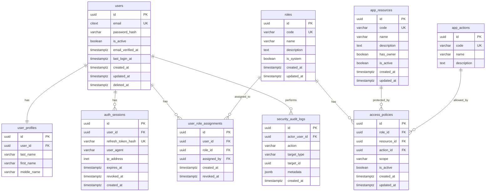

# Проектирование БД и системы разграничения доступа

## 1. Цель системы

Backend-приложение реализует собственную систему аутентификации и авторизации.

Система должна уметь:

- регистрировать пользователей;
- выполнять вход и выход из системы;
- определять текущего пользователя при последующих запросах;
- позволять пользователю редактировать свой профиль;
- выполнять мягкое удаление аккаунта;
- хранить роли пользователей;
- хранить список защищаемых ресурсов приложения;
- хранить набор действий, которые можно выполнять над ресурсами;
- хранить правила доступа: какая роль, к какому ресурсу, какое действие и в каком объёме может выполнять;
- возвращать `401 Unauthorized`, если пользователь не определён;
- возвращать `403 Forbidden`, если пользователь определён, но не имеет прав на действие;
- давать администратору API для просмотра и изменения правил доступа.

## 2. Общая идея авторизации

В системе используется ролевая модель доступа с поддержкой ограничения по владельцу объекта.

То есть пользователь получает одну или несколько ролей, например:

- `admin`;
- `manager`;
- `user`.

Каждая роль имеет набор правил доступа.

Правило доступа отвечает на вопрос:

> Может ли роль выполнить действие `read/create/update/delete/manage` над ресурсом `users/orders/products/access-policies`?

Дополнительно правило указывает область действия:

| Область | Значение |
|---|---|
| `none` | Доступ запрещён |
| `own` | Можно работать только со своими объектами |
| `all` | Можно работать со всеми объектами ресурса |

Например:

- обычный пользователь может читать и обновлять только свой профиль;
- менеджер может читать все заказы;
- администратор может управлять всеми пользователями и правилами доступа.

## 3. ER-диаграмма



## 4. Таблицы БД

## 4.1. `users и user_profiles`

Таблица хранит пользователей системы.

### users
| Поле | Тип | Описание |
|---|---|---|
| `id` | `uuid` | Первичный ключ пользователя |
| `email` | `citext` | Email пользователя. Должен быть уникальным без учёта регистра |
| `password_hash` | `varchar(255)` | Хэш пароля. Сырой пароль в БД не хранится |
| `is_active` | `boolean` | Активен ли аккаунт. При мягком удалении становится `false` |
| `email_verified_at` | `timestamptz`, nullable | Дата подтверждения email, если подтверждение используется |
| `last_login_at` | `timestamptz`, nullable | Дата последнего входа |
| `created_at` | `timestamptz` | Дата создания |
| `updated_at` | `timestamptz` | Дата обновления |
| `deleted_at` | `timestamptz`, nullable | Дата мягкого удаления |

### user_profiles
| Поле | Тип | Описание |
|---|---|---|
| `id` | `uuid` | Первичный ключ профиля пользователя |
| `user_id` | `uuid` | Пользователь, которому принадлежит профиль |
| `last_name` | `varchar(100)` | Фамилия |
| `first_name` | `varchar(100)` | Имя |
| `middle_name` | `varchar(100)`, nullable | Отчество |

### Ограничения

- `email` уникальный.
- `email` обязательный.
- `password_hash` обязательный.
- `first_name` и `last_name` обязательные.
- Пользователь с `is_active = false` не может войти в систему.
- При удалении аккаунта запись не удаляется физически, а обновляется:
  - `is_active = false`;
  - `deleted_at = now()`.

### Почему пароль хранится как `password_hash`

Пароль нельзя хранить в открытом виде.  
При регистрации пароль хэшируется, например, с помощью `bcrypt`.

При логине система:

1. находит пользователя по `email`;
2. проверяет, что `is_active = true`;
3. сравнивает введённый пароль с `password_hash`;
4. если всё корректно, создаёт сессию и выдаёт токены.

---

## 4.2. `auth_sessions`

Таблица хранит активные пользовательские сессии.

Даже если для API используются JWT-токены, таблица сессий полезна, потому что позволяет нормально реализовать `logout`.

Идея:

- после логина создаётся запись в `auth_sessions`;
- в JWT можно положить `user_id` и `session_id`;
- при каждом защищённом запросе backend проверяет не только JWT, но и существование активной сессии;
- при logout сессия помечается как отозванная.

| Поле | Тип | Описание |
|---|---|---|
| `id` | `uuid` | Первичный ключ сессии |
| `user_id` | `uuid` | Пользователь, которому принадлежит сессия |
| `refresh_token_hash` | `varchar(255)` | Хэш refresh-токена |
| `user_agent` | `varchar(255)`, nullable | Информация о браузере/клиенте |
| `ip_address` | `inet`, nullable | IP-адрес клиента |
| `expires_at` | `timestamptz` | Дата истечения сессии |
| `revoked_at` | `timestamptz`, nullable | Дата logout или принудительного отзыва сессии |
| `created_at` | `timestamptz` | Дата создания сессии |

### Когда сессия считается активной

Сессия активна, если:

```text
revoked_at IS NULL
AND expires_at > now()
```

### Logout

При logout сессия не удаляется физически.  
Она помечается как отозванная:

```text
revoked_at = now()
```

После этого токен с этим `session_id` больше не должен приниматься системой.

---

## 4.3. `roles`

Таблица хранит роли пользователей.

| Поле | Тип | Описание |
|---|---|---|
| `id` | `uuid` | Первичный ключ роли |
| `code` | `varchar(50)` | Системный код роли, например `admin`, `manager`, `user` |
| `name` | `varchar(100)` | Человекочитаемое название роли |
| `description` | `text`, nullable | Описание роли |
| `is_system` | `boolean` | Системная ли роль. Системные роли нельзя случайно удалить |
| `created_at` | `timestamptz` | Дата создания |
| `updated_at` | `timestamptz` | Дата обновления |

### Примеры ролей

| `code` | `name` | Описание |
|---|---|---|
| `admin` | Администратор | Полный доступ к системе |
| `manager` | Менеджер | Может работать с бизнес-объектами |
| `user` | Пользователь | Может работать со своим профилем и своими объектами |

---

## 4.4. `user_role_assignments`

Связующая таблица между пользователями и ролями.

Один пользователь может иметь несколько ролей.  
Например, пользователь может быть одновременно `user` и `manager`.

| Поле | Тип | Описание |
|---|---|---|
| `id` | `uuid` | Первичный ключ назначения роли |
| `user_id` | `uuid` | Пользователь |
| `role_id` | `uuid` | Роль |
| `assigned_by` | `uuid`, nullable | Администратор, который выдал роль |
| `created_at` | `timestamptz` | Дата назначения роли |
| `revoked_at` | `timestamptz`, nullable | Дата отзыва роли |

### Почему не поле `role_id` прямо в `users`

Связующая таблица лучше, потому что:

- пользователь может иметь несколько ролей;
- можно хранить историю назначения ролей;
- можно отзывать роль без удаления записи;
- можно видеть, кто назначил роль.

### Активная роль

Назначение роли активно, если:

```text
revoked_at IS NULL
```

---

## 4.5. `app_resources`

Таблица хранит ресурсы приложения, к которым можно ограничивать доступ.

Ресурс — это не обязательно таблица БД.  
Это может быть логический раздел приложения или API-модуль.

Например:

- пользователи;
- профиль;
- заказы;
- товары;
- магазины;
- правила доступа.

| Поле | Тип | Описание |
|---|---|---|
| `id` | `uuid` | Первичный ключ ресурса |
| `code` | `varchar(100)` | Системный код ресурса |
| `name` | `varchar(100)` | Название ресурса |
| `description` | `text`, nullable | Описание ресурса |
| `has_owner` | `boolean` | Есть ли у объектов этого ресурса владелец |
| `is_active` | `boolean` | Активен ли ресурс для проверки доступа |
| `created_at` | `timestamptz` | Дата создания |
| `updated_at` | `timestamptz` | Дата обновления |

### Примеры ресурсов

| `code` | `name` | `has_owner` | Описание |
|---|---|---:|---|
| `users` | Пользователи | `false` | Управление пользователями |
| `profile` | Профиль | `true` | Работа с собственным профилем |
| `orders` | Заказы | `true` | Вымышленные заказы |
| `products` | Товары | `false` | Вымышленные товары |
| `stores` | Магазины | `false` | Вымышленные магазины |
| `access_policies` | Правила доступа | `false` | Управление правилами авторизации |

---

## 4.6. `app_actions`

Таблица хранит действия, которые можно выполнять над ресурсами.

| Поле | Тип | Описание |
|---|---|---|
| `id` | `uuid` | Первичный ключ действия |
| `code` | `varchar(50)` | Системный код действия |
| `name` | `varchar(100)` | Название действия |
| `description` | `text`, nullable | Описание действия |

### Базовые действия

| `code` | Название | Описание |
|---|---|---|
| `read` | Чтение | Получение списка или конкретного объекта |
| `create` | Создание | Создание нового объекта |
| `update` | Обновление | Изменение объекта |
| `delete` | Удаление | Удаление объекта |
| `manage` | Управление | Административное управление ресурсом |

---

## 4.7. `access_policies`

Главная таблица системы авторизации.

Она хранит правило доступа для роли к ресурсу и действию.

| Поле | Тип | Описание |
|---|---|---|
| `id` | `uuid` | Первичный ключ правила |
| `role_id` | `uuid` | Роль, для которой действует правило |
| `resource_id` | `uuid` | Ресурс, к которому применяется правило |
| `action_id` | `uuid` | Действие над ресурсом |
| `scope` | `varchar(10)` | Область доступа: `none`, `own`, `all` |
| `is_active` | `boolean` | Активно ли правило |
| `created_at` | `timestamptz` | Дата создания |
| `updated_at` | `timestamptz` | Дата обновления |

### Значения `scope`

| Значение | Описание |
|---|---|
| `none` | Действие запрещено |
| `own` | Действие разрешено только над объектами пользователя |
| `all` | Действие разрешено над всеми объектами ресурса |

### Уникальность правила

Для одной роли, одного ресурса и одного действия должно быть только одно активное правило.

Логически это означает:

```text
role_id + resource_id + action_id = unique
```

### Примеры правил

| Роль | Ресурс | Действие | Scope | Что означает |
|---|---|---|---|---|
| `admin` | `users` | `read` | `all` | Админ может читать всех пользователей |
| `admin` | `users` | `update` | `all` | Админ может изменять всех пользователей |
| `admin` | `access_policies` | `manage` | `all` | Админ может управлять правилами доступа |
| `manager` | `orders` | `read` | `all` | Менеджер может видеть все заказы |
| `manager` | `orders` | `update` | `all` | Менеджер может менять все заказы |
| `user` | `profile` | `read` | `own` | Пользователь может читать свой профиль |
| `user` | `profile` | `update` | `own` | Пользователь может обновлять свой профиль |
| `user` | `orders` | `read` | `own` | Пользователь может видеть свои заказы |
| `user` | `orders` | `create` | `own` | Пользователь может создавать свои заказы |

---

## 4.8. `security_audit_logs`

Таблица для логирования важных действий.


| Поле | Тип | Описание |
|---|---|---|
| `id` | `uuid` | Первичный ключ события |
| `actor_user_id` | `uuid`, nullable | Пользователь, совершивший действие |
| `action` | `varchar(100)` | Что произошло |
| `target_type` | `varchar(100)`, nullable | Тип объекта, над которым выполнено действие |
| `target_id` | `uuid`, nullable | ID объекта |
| `metadata` | `jsonb` | Дополнительные данные |
| `created_at` | `timestamptz` | Дата события |

### Что можно логировать

- регистрацию;
- login;
- logout;
- мягкое удаление аккаунта;
- назначение роли;
- отзыв роли;
- создание правила доступа;
- изменение правила доступа;
- попытки доступа с ошибкой `403`.

---

# 5. Как работает аутентификация

## 5.1. Регистрация

Пользователь отправляет:

```json
{
  "last_name": "Иванов",
  "first_name": "Иван",
  "middle_name": "Иванович",
  "email": "ivan@example.com",
  "password": "password123",
  "password_repeat": "password123"
}
```

Backend:

1. Проверяет, что `password` и `password_repeat` совпадают.
2. Проверяет, что email ещё не занят активным пользователем.
3. Хэширует пароль.
4. Создаёт запись в `users`.
5. Назначает пользователю базовую роль `user`.
6. Возвращает успешный ответ.

Важно: `password_repeat` не хранится в БД.  
Он нужен только для проверки на этапе регистрации.

---

## 5.2. Login

Пользователь отправляет:

```json
{
  "email": "ivan@example.com",
  "password": "password123"
}
```

Backend:

1. Находит пользователя по email.
2. Проверяет, что пользователь существует.
3. Проверяет, что `is_active = true`.
4. Проверяет пароль через `bcrypt`.
5. Создаёт запись в `auth_sessions`.
6. Создаёт access-токен и refresh-токен.
7. Возвращает токены клиенту.

Пример payload access-токена:

```json
{
  "sub": "user_id",
  "sid": "session_id",
  "exp": 1720000000
}
```

## 5.3. Определение пользователя при последующих запросах

Клиент отправляет токен в заголовке:

```http
Authorization: Bearer <access_token>
```

Backend middleware:

1. Проверяет подпись JWT.
2. Достаёт из токена `user_id` и `session_id`.
3. Проверяет, что пользователь существует.
4. Проверяет, что `users.is_active = true`.
5. Проверяет, что сессия существует.
6. Проверяет, что сессия не отозвана.
7. Проверяет, что сессия не истекла.
8. Добавляет пользователя в `request.user`.

Если пользователя определить не удалось, возвращается:

```http
401 Unauthorized
```

## 5.4. Logout

Пользователь вызывает endpoint logout.

Backend:

1. Определяет текущую сессию по `session_id`.
2. Обновляет поле `auth_sessions.revoked_at`.
3. После этого токен этой сессии больше не считается действительным.

## 5.5. Мягкое удаление пользователя

Пользователь может удалить свой аккаунт.

Backend:

1. Проверяет, что пользователь авторизован.
2. Устанавливает:
   - `users.is_active = false`;
   - `users.deleted_at = now()`.
3. Отзывает все активные сессии пользователя.
4. Выполняет logout.
5. Пользователь больше не может войти в систему.
6. Запись пользователя остаётся в БД.

---

# 6. Как работает авторизация

## 6.1. Общий алгоритм проверки доступа

После аутентификации система должна проверить, имеет ли пользователь право выполнить действие.

Например:

```text
Пользователь хочет выполнить:
resource = orders
action = update
object_owner_id = id владельца заказа
```

Алгоритм:

1. Если пользователь не определён — вернуть `401 Unauthorized`.
2. Получить все активные роли пользователя.
3. Для каждой роли найти активные правила в `access_policies`.
4. Найти правила для нужного ресурса и действия.
5. Определить максимальный уровень доступа:
   - `all` сильнее `own`;
   - `own` сильнее `none`.
6. Если доступа нет — вернуть `403 Forbidden`.
7. Если доступ `all` — разрешить действие.
8. Если доступ `own`:
   - проверить, что ресурс поддерживает владельца (`has_owner = true`);
   - проверить, что `object_owner_id == request.user.id`;
   - если совпадает — разрешить;
   - если не совпадает — вернуть `403 Forbidden`.

## 6.2. Правило при нескольких ролях

Если у пользователя несколько ролей, применяется самое сильное разрешение.

Приоритет:

```text
all > own > none
```

Пример:

Пользователь имеет роли `user` и `manager`.

- `user` имеет `orders.read = own`;
- `manager` имеет `orders.read = all`.

Итоговый доступ:

```text
orders.read = all
```

## 6.3. Почему нет отдельного `read_all_permission`

Вместо множества boolean-полей используется поле `scope`.


```text
action = read
scope = own или all

action = update
scope = own или all

action = delete
scope = own или all
```

Так схема становится гибче:

- можно добавить новое действие без изменения структуры таблицы;
- можно добавить новый ресурс без изменения структуры таблицы;
- можно управлять правилами через API;
- не нужно добавлять новые boolean-колонки при расширении системы.

---

# 7. Минимальные mock-ресурсы бизнес-приложения


Например:

## 7.1. Mock orders

```json
[
  {
    "id": "order-1",
    "title": "Заказ №1",
    "owner_id": "user_id_1"
  },
  {
    "id": "order-2",
    "title": "Заказ №2",
    "owner_id": "user_id_2"
  }
]
```

Проверка доступа:

| Endpoint | Resource | Action | Проверка |
|---|---|---|---|
| `GET /api/orders` | `orders` | `read` | `own` видит свои, `all` видит все |
| `GET /api/orders/{id}` | `orders` | `read` | Проверяется владелец |
| `POST /api/orders` | `orders` | `create` | Проверяется право создания |
| `PATCH /api/orders/{id}` | `orders` | `update` | Проверяется владелец или `all` |
| `DELETE /api/orders/{id}` | `orders` | `delete` | Проверяется владелец или `all` |

## 7.2. Mock products

```json
[
  {
    "id": "product-1",
    "title": "Ноутбук"
  },
  {
    "id": "product-2",
    "title": "Монитор"
  }
]
```

У товаров нет владельца, поэтому `has_owner = false`.

Проверка доступа:

| Endpoint | Resource | Action |
|---|---|---|
| `GET /api/products` | `products` | `read` |
| `POST /api/products` | `products` | `create` |
| `PATCH /api/products/{id}` | `products` | `update` |
| `DELETE /api/products/{id}` | `products` | `delete` |

---

# 8. API для администратора

Администратор должен иметь возможность управлять системой доступа.

Минимальные endpoint'ы:

## 8.1. Управление ролями

| Метод | Endpoint | Описание |
|---|---|---|
| `GET` | `/api/admin/roles` | Получить список ролей |
| `POST` | `/api/admin/roles` | Создать роль |
| `PATCH` | `/api/admin/roles/{id}` | Обновить роль |
| `DELETE` | `/api/admin/roles/{id}` | Удалить или деактивировать роль |

## 8.2. Управление ролями пользователей

| Метод | Endpoint | Описание |
|---|---|---|
| `GET` | `/api/admin/users/{id}/roles` | Получить роли пользователя |
| `POST` | `/api/admin/users/{id}/roles` | Назначить роль |
| `DELETE` | `/api/admin/users/{id}/roles/{role_id}` | Отозвать роль |

## 8.3. Управление ресурсами

| Метод | Endpoint | Описание |
|---|---|---|
| `GET` | `/api/admin/resources` | Получить список ресурсов |
| `POST` | `/api/admin/resources` | Создать ресурс |
| `PATCH` | `/api/admin/resources/{id}` | Обновить ресурс |
| `DELETE` | `/api/admin/resources/{id}` | Деактивировать ресурс |

## 8.4. Управление действиями

| Метод | Endpoint | Описание |
|---|---|---|
| `GET` | `/api/admin/actions` | Получить список действий |
| `POST` | `/api/admin/actions` | Создать действие |
| `PATCH` | `/api/admin/actions/{id}` | Обновить действие |

## 8.5. Управление правилами доступа

| Метод | Endpoint | Описание |
|---|---|---|
| `GET` | `/api/admin/access-policies` | Получить список правил доступа |
| `POST` | `/api/admin/access-policies` | Создать правило доступа |
| `PATCH` | `/api/admin/access-policies/{id}` | Изменить правило доступа |
| `DELETE` | `/api/admin/access-policies/{id}` | Деактивировать правило доступа |

Доступ к этим endpoint'ам должен проверяться через то же самое правило:

```text
resource = access_policies
action = manage
scope = all
```

---

# 9. Стартовые тестовые данные

Для демонстрации системы нужно заполнить БД начальными данными.

## 9.1. Роли

| code | name |
|---|---|
| `admin` | Администратор |
| `manager` | Менеджер |
| `user` | Пользователь |

## 9.2. Действия

| code | name |
|---|---|
| `read` | Чтение |
| `create` | Создание |
| `update` | Обновление |
| `delete` | Удаление |
| `manage` | Управление |

## 9.3. Ресурсы

| code | has_owner |
|---|---:|
| `users` | `false` |
| `profile` | `true` |
| `orders` | `true` |
| `products` | `false` |
| `stores` | `false` |
| `access_policies` | `false` |

## 9.4. Правила для `admin`

| resource | action | scope |
|---|---|---|
| `users` | `read` | `all` |
| `users` | `create` | `all` |
| `users` | `update` | `all` |
| `users` | `delete` | `all` |
| `profile` | `read` | `all` |
| `profile` | `update` | `all` |
| `orders` | `read` | `all` |
| `orders` | `create` | `all` |
| `orders` | `update` | `all` |
| `orders` | `delete` | `all` |
| `products` | `read` | `all` |
| `products` | `create` | `all` |
| `products` | `update` | `all` |
| `products` | `delete` | `all` |
| `stores` | `read` | `all` |
| `stores` | `create` | `all` |
| `stores` | `update` | `all` |
| `stores` | `delete` | `all` |
| `access_policies` | `manage` | `all` |

## 9.5. Правила для `manager`

| resource | action | scope |
|---|---|---|
| `profile` | `read` | `own` |
| `profile` | `update` | `own` |
| `orders` | `read` | `all` |
| `orders` | `create` | `all` |
| `orders` | `update` | `all` |
| `products` | `read` | `all` |
| `stores` | `read` | `all` |

## 9.6. Правила для `user`

| resource | action | scope |
|---|---|---|
| `profile` | `read` | `own` |
| `profile` | `update` | `own` |
| `orders` | `read` | `own` |
| `orders` | `create` | `own` |
| `orders` | `update` | `own` |
| `products` | `read` | `all` |

---

# 10. Индексы и ограничения

## 10.1. `users`

Рекомендуемые индексы:

```sql
CREATE UNIQUE INDEX users_email_unique_idx ON users (email);
CREATE INDEX users_is_active_idx ON users (is_active);
```

## 10.2. `auth_sessions`

```sql
CREATE INDEX auth_sessions_user_id_idx ON auth_sessions (user_id);
CREATE INDEX auth_sessions_expires_at_idx ON auth_sessions (expires_at);
CREATE UNIQUE INDEX auth_sessions_refresh_token_hash_unique_idx ON auth_sessions (refresh_token_hash);
```

## 10.3. `roles`

```sql
CREATE UNIQUE INDEX roles_code_unique_idx ON roles (code);
```

## 10.4. `user_role_assignments`

```sql
CREATE INDEX user_role_assignments_user_id_idx ON user_role_assignments (user_id);
CREATE INDEX user_role_assignments_role_id_idx ON user_role_assignments (role_id);
```

Желательно запретить две одинаковые активные роли у одного пользователя:

```sql
CREATE UNIQUE INDEX user_role_assignments_active_unique_idx
ON user_role_assignments (user_id, role_id)
WHERE revoked_at IS NULL;
```

## 10.5. `app_resources`

```sql
CREATE UNIQUE INDEX app_resources_code_unique_idx ON app_resources (code);
```

## 10.6. `app_actions`

```sql
CREATE UNIQUE INDEX app_actions_code_unique_idx ON app_actions (code);
```

## 10.7. `access_policies`

```sql
CREATE UNIQUE INDEX access_policies_unique_idx
ON access_policies (role_id, resource_id, action_id);

CREATE INDEX access_policies_role_id_idx ON access_policies (role_id);
CREATE INDEX access_policies_resource_id_idx ON access_policies (resource_id);
```

Также желательно ограничить значения `scope`:

```sql
ALTER TABLE access_policies
ADD CONSTRAINT access_policies_scope_check
CHECK (scope IN ('none', 'own', 'all'));
```