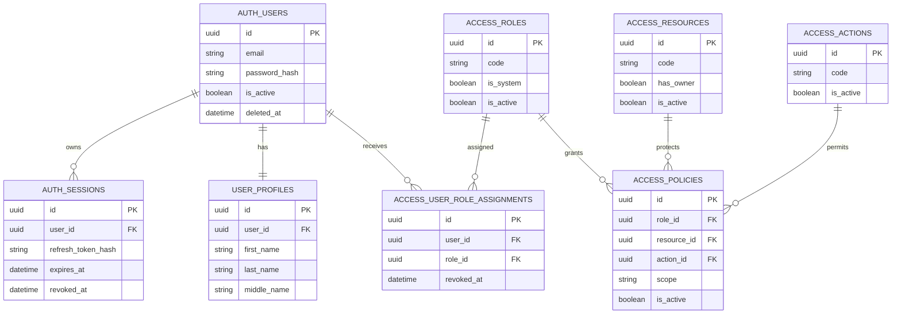

# Access control design

The application uses a custom `User` identity, Argon2id password hashes, short-lived access JWTs, rotating refresh JWTs, and database-backed sessions. The access token identifies a user and session; every authenticated request also checks that the session remains active. Refresh token values are never stored, only their SHA-256 hashes.

Authorization is policy-based RBAC. Active user-role assignments connect users to active roles. Active policies connect a role, resource, and action to `none`, `own`, or `all`. The strongest matching scope wins. `own` is valid only for resources declaring ownership and requires the object owner to match the authenticated user. No role, including `admin`, bypasses policy evaluation.

Authentication failures return `401` when no valid active user session can be established. Authorization failures return `403` after a user has been authenticated but no policy grants the requested action. Policy deletion is implemented as deactivation so the record remains available for audit and later reactivation.

Orders, products, and stores are process-memory demonstration objects. Their state is reset whenever the application process restarts and they have no database migrations.
